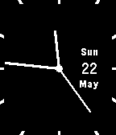
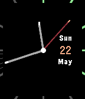
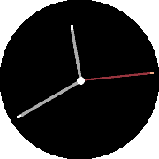
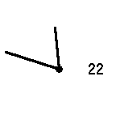
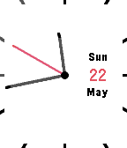

# Thin Extended

Simple, customizable Pebble watchface with splashes of color. 

Runs on both Pebble/Pebble Steel and Pebble Time/Time Steel/Time Round.

   

   

Use the config page to adjust which features you want from:

- Switch between default (black) and light (white) theme
- Show weekday/month
- Show day of the month
- Show (dis)connected indicator
- Show battery level
- Show seconds hand
- Hide seconds hand, if battery low
- Hide seconds hand at night
- Temporary show seconds hand on tap, if hidden
- Show battery charging state
- Show additional minute markers where needed
- Hide all markers and show langer hands instead

